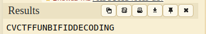

# Cryptoverse 2023

Solutions for challenged passed by me.

> Cryptoverse CTF 2023 is a 36-hour CTF targeted at beginner to intermediate players
>
> The event will focus on cryptography, reverse engineering, and programming. 

## Warump 1

Something to do with this: `GmvfHt8Kvq16282R6ej3o4A9Pp6MsN`.

Looks like kind of `base` but not obvious.

After analyze in [CyberChef](https://gchq.github.io/CyberChef/) we can see that's base58 encoding with ROT13 (Caesar's substitution - rotate alphabet by 13).


**cvctf{base58_with_rot}**

## Warump 2

> This cipher is invented by French cryptographer Felix Delastelle at the end of the 19th century.
>
> Ciphertext: `SCCGDSNFTXCOJPETGMDNG` Hint: `CTFISGODABEHJKLMNPQRUVWXY`
>
> Convert flag to lowercase. Add { and } to make it a valid flag format. No underscore is needed.

Felix Delastelle is author of many ciphers. In this case our key is [Bifid Cipher](https://en.wikipedia.org/wiki/Bifid_cipher). To solve this challenge I used [this](https://www.dcode.fr/bifid-cipher) useful website, where I used Hint as key. Why? It's text "CTF IS GOOD" and the rest of alphabet.

Let's decode!



And after make-up with content of challenge we got him: **cvctf{funbifiddecoding}**

## Baby AES

> Easy.

Challenge provides us file:

```python
from Crypto.Cipher import AES
from Crypto.Util.Padding import pad
from secret import flag

KEY_LEN = 2
BS = 16
key = pad(open("/dev/urandom","rb").read(KEY_LEN), BS)
iv =  open("/dev/urandom","rb").read(BS)

cipher = AES.new(key, AES.MODE_CBC, iv)
ct = cipher.encrypt(pad(flag, 16))

print(f"iv = {iv.hex()}")
print(f"ct = {ct.hex()}")

# Output:
# iv = 1df49bc50bc2432bd336b4609f2104f7
# ct = a40c6502436e3a21dd63c1553e4816967a75dfc0c7b90328f00af93f0094ed62
```

Okay, as title said, in this case we have a brush with AES in CBC mode, so to decrypt we need key and iv. Python script provides us the second one but what with the key? It's only 16 byte length. What about bruteforce? YES!

But there's another way to decrypt. If we run above code a few times we can see that every key begins with 4 bits, and the rest is `\0e` repeated. So out bruteforce will be a bit faster:

```python
from Crypto.Cipher import AES
from Crypto.Util.Padding import pad
from Crypto.Util.number import long_to_bytes

iv = 0x1df49bc50bc2432bd336b4609f2104f7
ct = 0xa40c6502436e3a21dd63c1553e4816967a75dfc0c7b90328f00af93f0094ed62
iv = long_to_bytes(iv)
ct = long_to_bytes(ct)

i =   0x00010000000000000000000000000000
while 1:
    key = 0x10000e0e0e0e0e0e0e0e0e0e0e0e0e0e
    key += i
    key = long_to_bytes(key)

    cipher = AES.new(key, AES.MODE_CBC, iv)
    cleartext = cipher.decrypt(ct)
    try:
        if 'cvctf{' in cleartext.decode('UTF-8'):
            print(cleartext.decode('UTF-8'))
            exit(0)
    except:
        pass
    i += 0x00010000000000000000000000000000
```

And program gives us flag: **cvctf{b4by_AES_s1mpL3}**

## LFSR Explorer 

Bored python scripts? Great! There's another:

```python
from Crypto.Util.number import *
from secret import flag

assert flag.startswith("cvctf{")
assert flag.endswith("}")

flag = flag[6:-1].encode()
assert len(flag) == 8

def explore(state, mask):
    curr = (state << 1) & 0xffffffff
    i = state & mask & 0xffffffff
    last = 0
    while i != 0:
        last ^= (i & 1)
        i >>= 1
    curr ^= last
    return (curr, last)

states = [bytes_to_long(flag[4:]), bytes_to_long(flag[:4])]
mask = 0b10000100010010001000100000010101

output = []
for i in range(8):
    tmp = 0
    for j in range(8):
        (states[i // 4], out) = explore(states[i // 4], mask)
        tmp = (tmp << 1) ^ out
    output.append(tmp)

with open("output.txt", "wb") as f:
    f.write(bytes(output))

```
And output file is in byte view: `b'\xd5\xe4\xb7\xc7\x92$\x8e2'`


And here we go! Program that submits our flag:
```python
from Crypto.Util.number import *

def number_bytes(i):
    last = 0
    while i != 0:
        last ^= (i & 1)
        i >>= 1
    return last


with open("output.txt", "rb") as f:
    data = f.read()

mask = 0b10000100010010001000100000010101

left = bytes_to_long(data[4:])
right = bytes_to_long(data[:4])
elements = [left, right]

for flag in elements:
    flag_str = format(flag, '#b')[2:]
    for i in range (32):
        flag = flag // 2
        if(number_bytes(flag & mask) != ord(flag_str[31-i]) - 48):
            flag += 1 * (2 ** 31)
    print(long_to_bytes(flag).decode(), end="")
```

**cvctf{G@@d_j0b}**