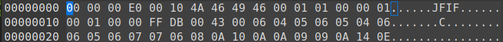

# TUCTF 2023

>TUCTF is an annual Capture the Flag competition hosted by the CTF club at the University of Tulsa.
>
>The 2023 TUCTF Competition is a jeopardy-style CTF designed for a range of skill levels. It will start at 12:00pm ET on Friday, December 1, 2023 and run for 48 hours until 12:00pm ET on Sunday, December 3, 2023.

## Keyboard cipher

We start only with number = `0x636a56355279424b615464354946686b566942794e586c4849455279523359674d47394d49486845643045675a316b315569426163304d675a316c715469426163314567616b6c7354534268563252594947745063434178643045675332395149466c6e536d343d`, and we don't know what to do. So the first thing - read as bytes!

```python
number = long_to_bytes(number)
print(number.decode())

>>> cjV5RyBKaTd5IFhkViByNXlHIERyR3YgMG9MIHhEd0EgZ1k1UiBac0MgZ1lqTiBac1EgaklsTSBhV2RYIGtPcCAxd0EgS29QIFlnSm4=
```
It seems like base64 encoding, so decode that!
```python
number = number.decode('utf-8')
number = base64.b64decode(number)
number = number.decode('utf-8')
print(number)

>>> r5yG Ji7y XdV r5yG DrGv 0oL xDwA gY5R ZsC gYjN ZsQ jIlM aWdX kOp 1wA KoP YgJn
```

And what's going on? It's called "keyboard cipher" so look at typical QWERTY keyboard. Every group of signs surrounds one letter - e. g. r5yG are around 't' letter. Similary, decoding other letters we got the flag (all lowercase) - **TUCTF{tuctfpstxhakslqlh}**

## What Are You Doing In My Swamp?

The challenge gives us damaged [file](./files/layers.jpg) - seems like jpg (name is "layers.jpg"), but there's something wrong with the file - cannot open.


Indeed, the header is filled by zeros. To get hex view of file I use [ghex](https://wiki.gnome.org/Apps/Ghex) tool.



From [this](https://en.wikipedia.org/wiki/JPEG_File_Interchange_Format#File_format_structure) useful site we can see how to repair the header (again, using ghex).

After that we get the image file with [Atbash Cipher](https://en.wikipedia.org/wiki/Atbash).


What's next? Well: 
- the name is "layers" 
- hint to the challenge:
    >This challenge is like ogres, it has layers

so should we use kind of stegano tool to extract the layer (maybe with ogres)? Exactly! This time we use the [stegseek](https://github.com/RickdeJager/stegseek). 

`$ stegseek layers.jpg`

This gives us a new file - `layers.jpg.out`. Let's see it:

```
$ cat layers.jpg.out

GFXGU{LtIvh_zIv_oRpv_lmrOmh}


######################################################################################
#                                                                                    #
#                            ,.--------._                                            #
#                           /            ''.                                         #
#                         ,'                \     |"\                /\          /\  #
#                /"|     /                   \    |__"              ( \\        // ) #
#               "_"|    /           z#####z   \  //                  \ \\      // /  #
#                 \\  #####        ##------".  \//                    \_\\||||//_/   #
#                  \\/-----\     /          ".  \                      \/ _  _ \     #
#                   \|      \   |   ,,--..       \                    \/|(O)(O)|     #
#                   | ,.--._ \  (  | ##   \)      \                  \/ |      |     #
#                   |(  ##  )/   \ `-....-//       |///////////////_\/  \      /     #
#                     '--'."      \                \              //     |____|      #
#                  /'    /         ) --.            \            ||     /      \     #
#               ,..|     \.________/    `-..         \   \       \|     \ 0  0 /     #
#            _,##/ |   ,/   /   \           \         \   \       U    / \_//_/      #
#          :###.-  |  ,/   /     \        /' ""\      .\        (     /              #
#         /####|   |   (.___________,---',/    |       |\=._____|  |_/               #
#        /#####|   |     \__|__|__|__|_,/             |####\    |  ||                #
#       /######\   \      \__________/                /#####|   \  ||                #
#      /|#######`. `\                                /#######\   | ||                #
#     /++\#########\  \                      _,'    _/#########\ | ||                #
#    /++++|#########|  \      .---..       ,/      ,'##########.\|_||  Donkey By     #
#   //++++|#########\.  \.              ,-/      ,'########,+++++\\_\\ Hard'96       #
#  /++++++|##########\.   '._        _,/       ,'######,''++++++++\                  #
# |+++++++|###########|       -----."        _'#######' +++++++++++\                 #
# |+++++++|############\.     \\     //      /#######/++++ S@yaN +++\                #
#      ________________________\\___//______________________________________         #
#     / ____________________________________________________________________)        #
#    / /              _                                             _                #
#    | |             | |                                           | |               #
#     \ \            | | _           ____           ____           | |  _            #
#      \ \           | || \         / ___)         / _  )          | | / )           #
#  _____) )          | | | |        | |           (  __ /          | |< (            #
# (______/           |_| |_|        |_|            \_____)         |_| \_)           #
#                                                                           19.08.02 #
######################################################################################
```
There is ogre! N I C E.

The first line gives us something that looks kinda like flag, but the format is corrupted. And now it's time to use... Atbash Cipher! You can simply decode that by yourself or useing this helpful [site](https://www.dcode.fr/atbash-cipher?__r=1.d6c51c93adee06c770c014fd9585468b).

And we got that! **TUCTF{OgRes_aRe_lIke_oniLns}**

The flag is not only my achievment - thank you **cpt** for help!

## Custom ECB Cipher

I should go to hell for this.

The challenge gives us python [file]:
```python
from Crypto.Util import number

flag = b"xxxxxxxxxxxxxxxxxxxxxxxxxxxxxxxxxxxxxxxxxxx"

def convert(msg):
    msg = msg ^ msg >> x
    msg = msg ^ msg << 13 & 275128763
    msg = msg ^ msg << 20 & 2186268085
    msg = msg ^ msg >> 14
    return msg

def transform(message):
    assert len(message) % 4 == 0
    new_message = b''
    for i in range(int(len(message) / 4)):
        block = message[i * 4 : i * 4 +4]
        block = number.bytes_to_long(block)
        block = convert(block)
        block = number.long_to_bytes(block, 4)
        new_message += block
    return new_message

c = transform(flag[6:-1]).hex()
print('c =', c)
'''
c = e34a707c5c1970cc6375181577612a4ed07a2c3e3f441d6af808a8acd4310b89bd7e2bb9
'''

```
And there are two problems to solve:

&#x2610; What is `x` value?

&#x2610; What is the flag?

Function `convert` seems like easy to reverse? Not really...

I spent a lot of time at this challenge, but I wrote and run in background brute-force solution. The block are 4-byte size, so what if I calculate values for all the blocks and compare it with the blocks from encrypted flag? 

Code is simple - for every x it calculates value for every possible 4-byte block. If it finds values for every of 9 blocks - we get the flag. And it works!
```python
from Crypto.Util import number

def convert(msg, x):
    msg = msg ^ msg >> x
    msg = msg ^ msg << 13 & 275128763
    msg = msg ^ msg << 20 & 2186268085
    msg = msg ^ msg >> 14
    return msg

for x in range (16):
    print(f"x = {x}")
    for i in range (33, 127):
        for j in range(33,127):
            for k in range(33, 127):
                for m in range(33, 127):
                    num = i + 16**2 * j + 16**4 * k + 16**6 * m
                    val = str(hex(convert(num, x)))[2:]
                    if(val == 'e34a707c' or val == '5c1970cc' or val == '63751815' or val =='77612a4e' or val =='d07a2c3e' or val =='3f441d6a' or val =='f808a8ac' or val =='d4310b89' or val =='bd7e2bb9'):
                        print(val, number.long_to_bytes(num))
```

After mapping decoded blocks to flag we got that: **TUCTF{sRta^s90s-#VgsnzPsta-TjLx7s8Txgs-*Ko}**.

I am not pround of this solution as Crypto enthusiast, but if something is stupid and it works, it isn't stupid.